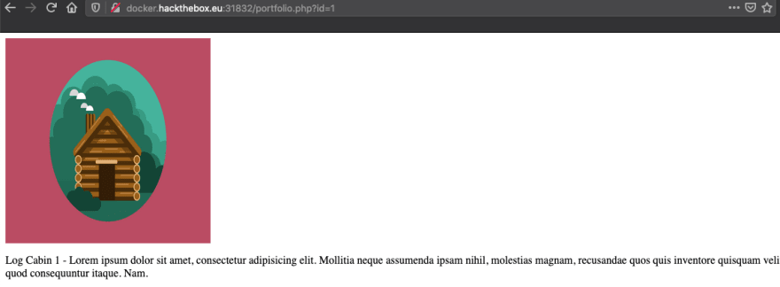
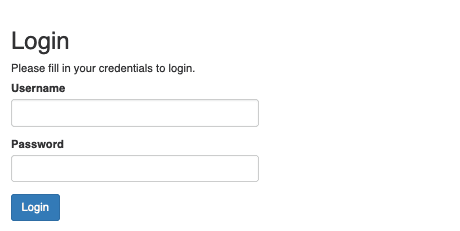

# FreeLancer
If you look at the page code, you will come across such commented codes :
```html
<!-- <a href="portfolio.php?id=1">Portfolio 1</a> -->
```
>`[Address]` means challenge address because this address may be different for each participant. We used this symbol to indicate the challenge address.

like a lot of comments with pages to look at and that the portfolio is using the URL parameters. These all might be exploit points.

If we look at the page `[Address]/portfolio.php?id=1?` we can see that it is just that image that was shown on the home page, a label, and some filler text.

<p align="center">

<br>
If I visit other ID numbers the first 3 are all the same and the fourth and up are just images with no text.
</p>

If again and try a few different inputs I find that anything other than a ";" returns just the image with no text but if I used the ";" then I get the text back. Now I want to try something a little more so I am going to move on to SQLMap to make this quicker.


For SQLmap I am going to run `python sqlmap.py -u [Address]/portfolio.php?id=1 --tables` which gave me 4 databases: `performance_schema`, `mysql`, `information_schema`, and `freelancer`. Freelance looks like the one we want and it has two tables in it: `portfolio` and `safeadmin`.

Now that I know the tables I am going to change my query with SQLmap to `python sqlmap.py -u [Address]/portfolio.php?id=1 -T safeadmin --dump` to specify that I know the Table and I want to dump its contents. 

> `It seemed that we would not get results with this method`

Running ZAP did produce a file of `/administrat` that was not linked on the site and when I went there it was an admin login page.

<p align="center">

</p>

I found two PHP files named `logout.php` and `panel.php` but the server does not allow us to access them.
To be able to download these files and view their source code, we can use sqlmap.

Usually the pages are stored in the `/var/www/html` path. You can use this method to download the files :
```
python sqlmap.py -u [Address]/portfolio.php?id=1 --file-read=/var/www/html/administrat/panel.php
```
After downloading the file, if you go to path `/.sqlmap/output/[Address]` in your system
You will see the downloaded file here and if you look at the code of this file you will see that there is a flag.