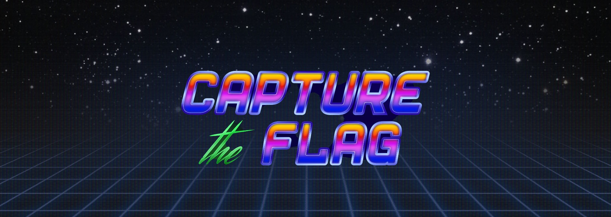

# CTF Writeups

 
<i>Writeups Challenges I have solved</i>

 

<i>You can see all the writeups here</i>
- 
-  

* [Writeups](https://github.com/xiosec/CTF-writeups)
    * [HackTheBox](#hackthebox)
    * [TryHackMe](#tryhackme)
    * [CTF](#ctf)
    * [CTFLearn](#ctflearn)

# HackTheBox
| Name  | Type | Descriptions | Writeup | 
| ----- | ---- | ------------ | ------- |
| Previse | Machine | Previse Hackthebox walkthrough | Removed ❌ |
| Toxic | Web | Humanity has exploited our allies, the dart frogs, for far too long, take back the freedom of our lovely poisonous friends. Malicious input is out of the question when dart frogs meet industrialisation. 🐸 | [Writeup](HackTheBox/challenges/web/Toxic) | 
| Emdee five for life | Web | Can you encrypt fast enough? | [Writeup](HackTheBox/challenges/web/Emdee-five-for-life) |
| FreeLancer | Web | Can you test how secure my website is? Prove me wrong and capture the flag! | [Writeup](HackTheBox/challenges/web/FreeLancer) |
| Templated | Web | Can you exploit this simple mistake? | [Writeup](HackTheBox/challenges/web/Templated) |
| Impossible Password | Reversing | Are you able to cheat me and get the flag? | [Writeup](HackTheBox/challenges/reversing/Impossible-Password) |
| Illumination | Forensics | A Junior Developer just switched to a new source control platform. Can you find the secret token? | [Writeup](HackTheBox/challenges/forensics/Illumination) |
| Phonebook | Web | Who is lucky enough to be included in the phonebook? | [Writeup](HackTheBox/challenges/web/Phonebook) |
| baby ninja jinja | Web | The elders of the village summoned you to take the reigns after the recent death of you father. It's time to end the emperor's gruesome tyranny. | [Writeup](HackTheBox/challenges/web/baby-ninja-jinja) |
| Gunship | Web | A city of lights, with retrofuturistic 80s peoples, and coffee, and drinks from another world... all the wooing in the world to make you feel more lonely... this ride ends here, with a tribute page of the British synthwave band called Gunship. 🎶 | [Writeup](HackTheBox/challenges/web/Gunship) |
| Hancliffe | Machine | Hancliffe Hackthebox walkthrough | Removed ❌ |
| Pandora  | Machine | Hackthebox Pandora walkthrough | Removed ❌ |
| Shibboleth | Machine | Hackthebox Shibboleth walkthrough | Removed ❌ |
# Tryhackme
| Name  | Type | Descriptions | Writeup | 
| ----- | ---- | ------------ | ------- |
| Basic Malware RE | Room | This room aims towards helping everyone learn about the basics of “Malware Reverse Engineering”. | [Writeup](https://medium.com/@xiosec/tryhackme-basic-malware-re-bfcd518fd314) |
| Reversing ELF | Room | Room for beginner Reverse Engineering CTF players. | [Writeup](https://medium.com/@xiosec/tryhackme-reversing-elf-60ab96969e41) |
| Reverse Engineering | Room | This room focuses on teaching the basics of assembly through reverse engineering. | [Writeup](https://medium.com/@xiosec/tryhackme-reverse-engineering-9cd408849f13) |
| Blue | Machine | Deploy & hack into a Windows machine, leveraging common misconfigurations issues. | [Writeup](https://medium.com/@xiosec/tryhackme-blue-1ccfae7c2e8a) |
| OWASP Top 10 | Room | Learn about and exploit each of the OWASP Top 10 vulnerabilities; the 10 most critical web security risks. | [Writeup](https://medium.com/@xiosec/tryhackme-owasp-top-10-e2b342c4f9f8) |
| Nmap Room | Room |  An in depth look at scanning with Nmap, a powerful network scanning tool. | [Writeup](https://medium.com/@xiosec/tryhackme-nmap-room-9db134d5c8cc) |
| The find command | Room | A learn-by-doing approach to the find command. | [Writeup](https://medium.com/@xiosec/tryhackme-the-find-command-d64026d89c3) |
| Disk Analysis & Autopsy | Forensic | Ready for a challenge? Use Autopsy to investigate artifacts from a disk image. | [Writeup](https://medium.com/@xiosec/tryhackme-disk-analysis-autopsy-f967c64feaf1) |
| Internal | CTF | Penetration Testing Challenge | [Writeup](https://medium.com/@xiosec/tryhackme-internal-a64eed0b1562) |
| Lumberjack Turtle | CTF | No logs, no crime... so says the lumberjack. | [Writeup](https://medium.com/@xiosec/tryhackme-lumberjack-turtle-db006d0a589e) |
| Brainpan 1 | CTF | Reverse engineer a Windows executable, find a buffer overflow and exploit it on a Linux machine. | [Writeup](https://medium.com/@xiosec/tryhackme-brainpan-1-ff227d42189e) |

# CTF
| Name  | Format | Descriptions | Writeup | 
| ----- | ------ | ------------ | ------- |
| [picoCTF 2022](https://ctftime.org/event/1578) | Jeopardy | picoCTF 2022 is an annual capture-the-flag (CTF) hacking competition where participants gain access to a safe and unique hands on experience. | [Writeup](https://xiosec.github.io/post/picoCTF2022) |
| [CyberApocalypseCTF2022](https://ctftime.org/event/1639) | Jeopardy | A super villain named Draeger escaped from a maximum security prison, formed his own evil squad, and convinced the Intergalactic Federal Government to work for him! You are a group of misfits that came together under unlikely circumstances, each with their own hacking “superpowers” and past with Draeger… | [Writeup](https://xiosec.github.io/post/CyberApocalypseCTF2022-Forensics) |
| [Lexington Informatics Tournament CTF 2022](https://ctftime.org/event/1694) | Jeopardy | Lexington Informatics Tournament CTF 2022 is a Jeopardy-style, beginner-friendly online CTF that's open to everyone. It is hosted by the LexMACS club from Lexington High School. | [Writeup](https://xiosec.github.io/post/LIT-CTF-2022) |

# CTFLearn
| Name  | Type | Descriptions | Writeup | 
| ----- | ---- | ------------ | ------- |
| Inj3ction Time | Web | I stumbled upon this website: http://web.ctflearn.com/web8/ and I think they have the flag in their somewhere. UNION might be a helpful command | [Writeup](CTFlearn/web/Inj3ction-Time) |
| Calculat3 M3  | Web | Here! http://web.ctflearn.com/web7/ I forget how we were doing those calculations, but something tells me it was pretty insecure. | [Writeup](CTFlearn/web/Calculat3-M3) |

## License

Released under [MIT](/LICENSE) by [@xiosec](https://github.com/xiosec).
